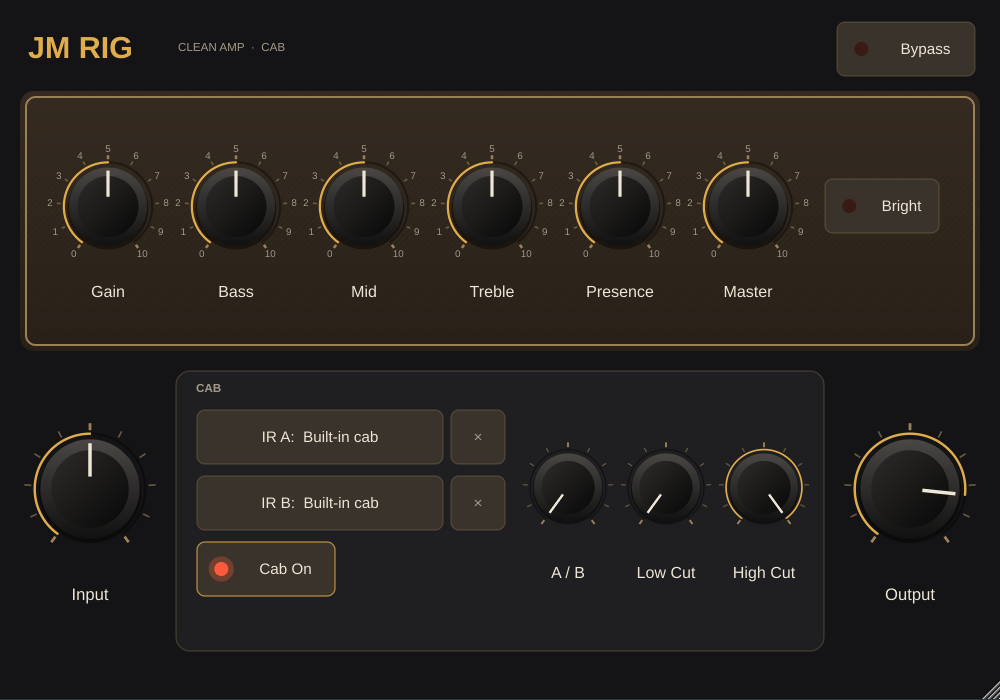

# JM Rig

A circuit-modelled guitar amp and cab for macOS (AU, AUv3, Standalone) and iPadOS
(AUv3 + Standalone app), built with JUCE 9.0.3 and C++20.

An independent project, not affiliated with any trademark.

## Status

**0.3.0: amp.** A circuit-modelled, Dumble/Two-Rock-style clean amp into a cab
that plays your own impulse responses.

The amp is modelled stage by stage: two 12AX7 gain stages solved from Koren's
tube equations on their load lines, the bass/mid/treble tone stack solved exactly
from its circuit, the Gain pot with its bright cap, and a push-pull power section
with supply sag, presence and output transformer. It stays clean at low Gain and
breaks up as Gain rises, the way the real circuit does (about 1% THD at Gain 2,
10% at 8, 29% at 10 for a single-coil level signal).

The preamp is checked against SPICE simulations of the same circuit: small-signal
response within 0.35 dB at every knob setting tested, and waveform nulls of
-21 to -25 dB up to 1 V at the input.

The cab has two IR slots (A and B) with a blend, a low cut, a high cut and an
on/off switch. Load WAV, AIFF or FLAC files up to 0.5 s at any sample rate. Each IR
is normalised to the same loudness, and the file itself is saved inside your
session, so it comes back on another computer or inside the iPad's AUv3 sandbox.
With no IR loaded, a built-in generic 1x12 response is used.

```
input gain -> DC block -> amp (4x oversampled) -> cab -> output gain
                                                         \
dry, delayed by the reported latency -------------- bypass crossfade
```

## Interface



One screen, laid out for an iPad in landscape and scaled to fit any window or
AUv3 host. Drag a knob up/down or sideways to turn it, and double-tap it to
return to the default. While you turn it, the caption under the knob shows its
value, since your finger covers the pointer. Every control is at least 44 pt,
Apple's minimum touch target, at the smallest window size.

## Roadmap

1. **Skeleton** (done): CMake project, headless engine, AU/AUv3/Standalone, CI.
2. **Cab** (done): zero-latency IR convolution for your own IRs, A/B blend, low/high cut.
3. **Amp** (done): Dumble/Two-Rock-style clean amp. Circuit-exact tone stack,
   12AX7 stages on their load lines, power amp with sag. Gain, Bass, Mid,
   Treble, Presence, Master, Bright.
4. **Tune and test** (in progress): null tests against SPICE (done), iPad CPU
   profiling, touch UI, tuning by ear.

## Building

Clone with the JUCE submodule:

```sh
git clone --recursive https://github.com/kgoniszewski/jm-rig.git
```

macOS (Xcode project; AUv3 needs the Xcode generator):

```sh
cmake -S . -B build -G Xcode
open build/JMRig.xcodeproj
```

iPadOS (pick your team under Signing & Capabilities for both the app and the
AUv3 extension, then run on the iPad):

```sh
cmake -S . -B build-ios -G Xcode -DCMAKE_SYSTEM_NAME=iOS -DCMAKE_OSX_DEPLOYMENT_TARGET=17.0
open build-ios/JMRig.xcodeproj
```

Engine tests and SPICE null tests (any platform):

```sh
cmake -S . -B build -G Ninja -DCMAKE_BUILD_TYPE=Release
cmake --build build --target JMRigTests JMRigSpiceTests && ctest --test-dir build
```

To also run every `.wav` in a folder through the real IR path (decode, load,
play, check for allocations), point `JMRIG_IR_DIR` at it. IRs are not kept in
this repo.

```sh
JMRIG_IR_DIR=~/IRs ./build/JMRigTests_artefacts/Release/JMRigTests
```

The SPICE reference data is committed under `tests/data/spice`. After changing
a circuit value, regenerate it with ngspice (`apt install ngspice` or
`brew install ngspice`):

```sh
python3 tools/spice/generate.py
```

## Layout

- `source/dsp/`: headless engine. No GUI, no APVTS, nothing that may block.
- `source/plugin/`: processor, parameters, editor.
- `tests/`: engine tests (allocation-free `process()`, block-size edge cases,
  latency, denormals) and the SPICE null tests.
- `tools/spice/`: the ngspice reference circuit and the script that renders it.
- `docs/architecture.md`: design notes and the real-time rules.
